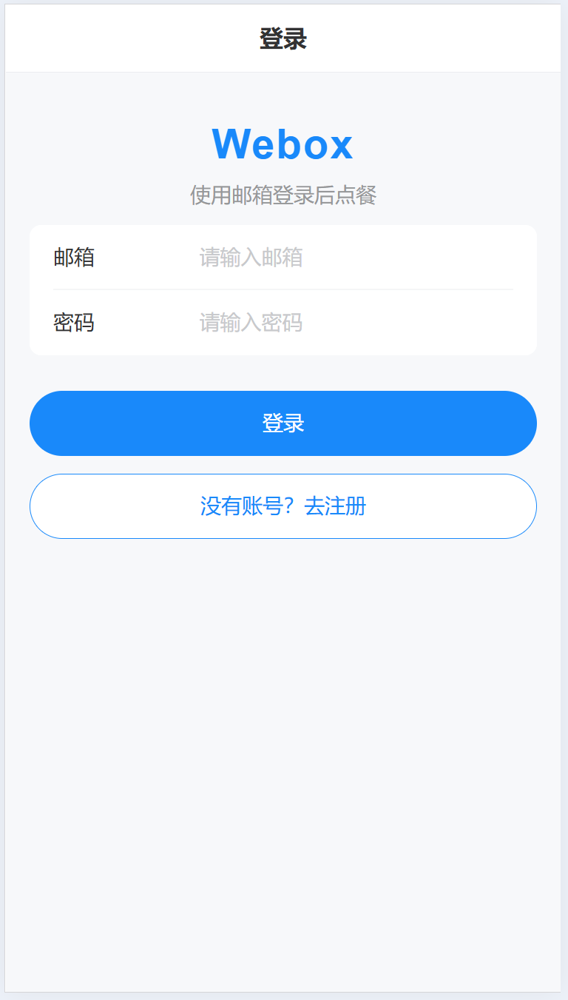
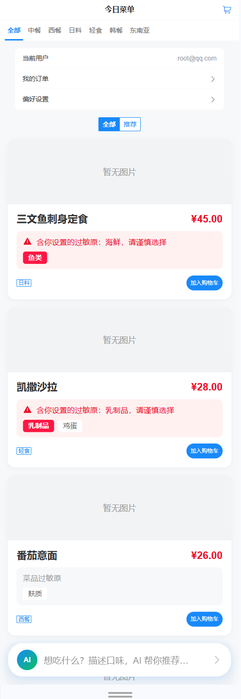
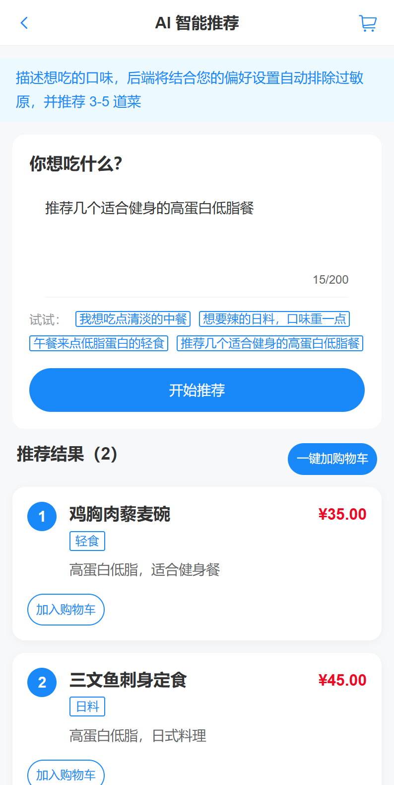
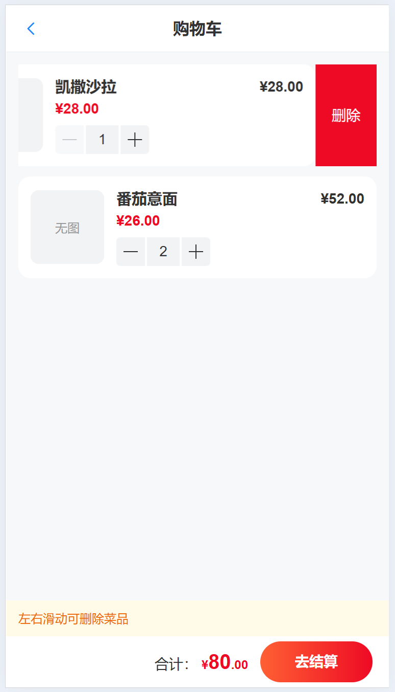
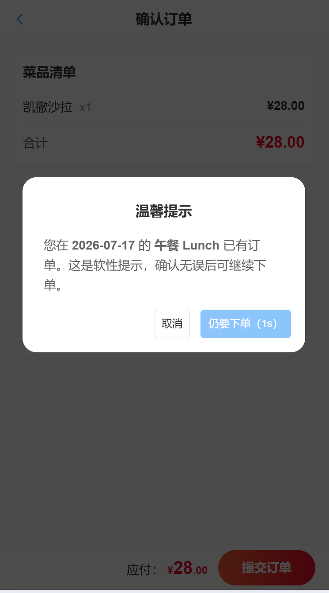
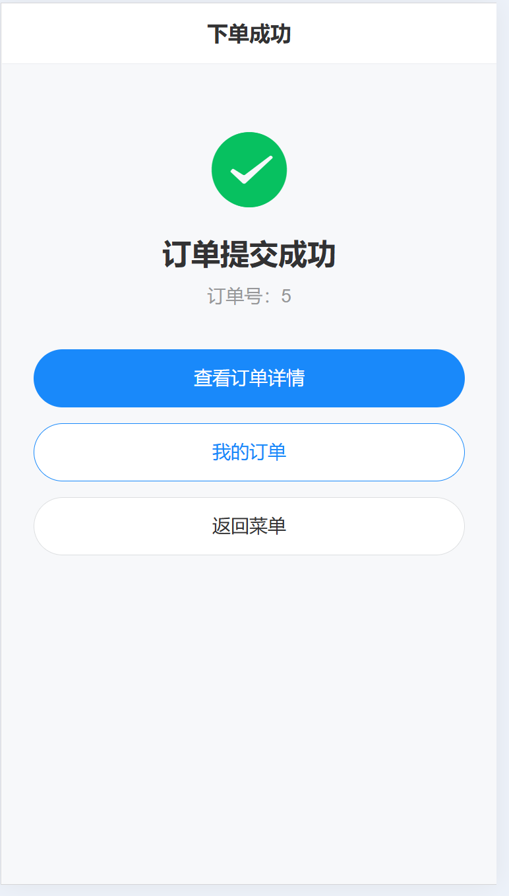
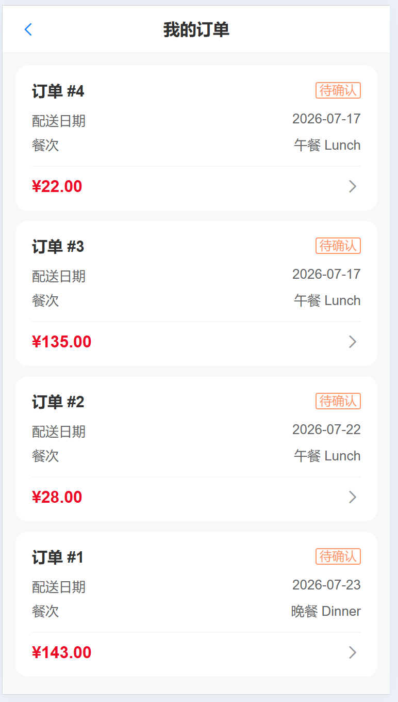
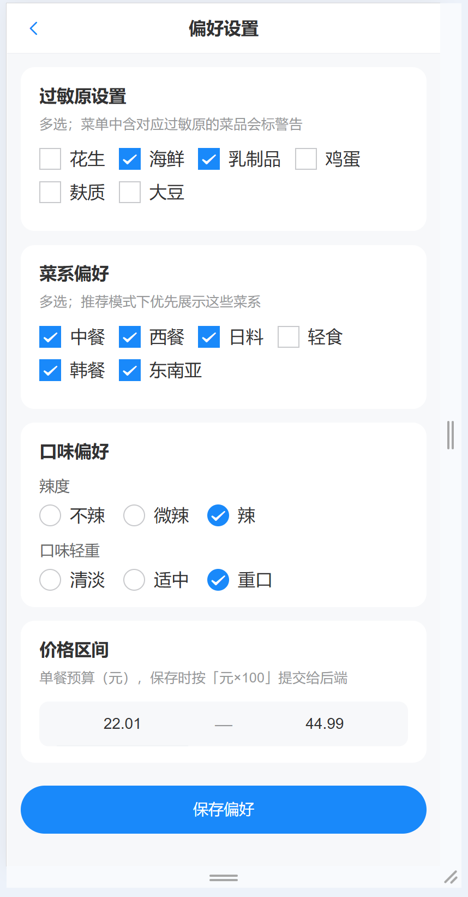
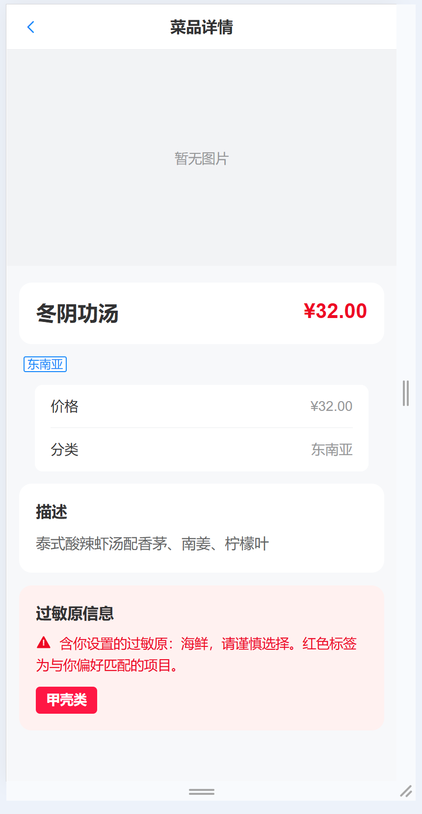

# Webox Demo

订餐系统 Demo，内容包括：

- 前端路由
- 后端 API
- 核心设计与当前边界说明
- 后门接口 `.http` 文件（可直接执行）：`webox-backend/src/main/resources/test.http`

---

## 前端页面

| 路径 | 说明 |
| :--- | :--- |
| `/register` | 用户注册页 |
| `/login` | 用户登录页 |
| `/menu` | 菜单主页（分类筛选；按分类 → 辣度 → 口味优先级排序；推荐模式按预算过滤；AI 推荐入口） |
| `/menu/:id` | 菜品详情页 |
| `/cart` | 购物车页面 |
| `/checkout` | 订单确认与提交页 |
| `/order/success` | 订单提交成功页 |
| `/orders` | 用户历史订单列表页 |
| `/orders/:id` | 单个订单详情页 |
| `/preferences` | 用户偏好设置页（加分项 A） |
| `/ai-recommend` | AI 智能推荐页（自然语言问答推荐，加分项 B） |

---

## 后端接口

入参 / 出参字段统一使用**小驼峰**（如 `deliveryDate`）。

### 1. 认证模块（Auth）

| 方法 | 路径 | 功能描述 | 请求体示例 |
| :--- | :--- | :--- | :--- |
| `POST` | `/api/auth/register` | 用户注册 | `{ "email": "user@example.com", "password": "password123", "name": "张三" }` |
| `POST` | `/api/auth/login` | 用户登录 | `{ "email": "user@example.com", "password": "password123" }` |
| `POST` | `/api/auth/logout` | 用户登出 | — |

### 2. 菜单模块（Menu）

| 方法 | 路径 | 功能描述 | 备注 |
| :--- | :--- | :--- | :--- |
| `GET` | `/api/menu` | 获取菜单列表 | 支持查询参数筛选，如 `?category=chinese` |
| `GET` | `/api/menu/:id` | 获取单个菜品详情 | — |

### 3. 购物车模块（Cart）

| 方法 | 路径 | 功能描述 | 请求体示例 |
| :--- | :--- | :--- | :--- |
| `GET` | `/api/cart` | 获取当前用户的购物车内容 | — |
| `POST` | `/api/cart/items` | 向购物车添加菜品 | `{ "menuItemId": 1, "quantity": 1 }` |
| `PUT` | `/api/cart/items/:id` | 更新购物车中某个菜品的数量 | `{ "quantity": 2 }` |
| `DELETE` | `/api/cart/items/:id` | 从购物车中移除某个菜品 | — |

### 4. 订单模块（Order）

| 方法 | 路径 | 功能描述 | 请求体示例 |
| :--- | :--- | :--- | :--- |
| `POST` | `/api/orders` | 创建并提交新订单 | `{ "deliveryDate": "2026-07-15", "mealPeriod": "lunch", "deliveryAddress": "上海市..." }` |
| `GET` | `/api/orders` | 获取当前用户的历史订单列表 | — |
| `GET` | `/api/orders/:id` | 获取单个订单的详细信息 | — |

### 5. 用户偏好模块（Preferences）— 加分项 A

| 方法 | 路径 | 功能描述 | 请求体示例 |
| :--- | :--- | :--- | :--- |
| `GET` | `/api/users/me/preferences` | 获取当前用户的偏好设置 | — |
| `PUT` | `/api/users/me/preferences` | 更新当前用户的偏好设置 | `{ "allergens": ["peanut"], "cuisinePreferences": ["chinese"], "spicinessLevel": 50, "tasteLevel": 90, "proteinLevel": 50, "fatLevel": 10, "preferredMinPrice": 1500, "preferredMaxPrice": 3000 }` |

### 6. AI 推荐模块（AI Recommendation）— 加分项 B

| 方法 | 路径 | 功能描述 | 请求体示例 |
| :--- | :--- | :--- | :--- |
| `POST` | `/api/recommendations` | AI 智能推荐菜品（需登录；自动排除用户过敏原；结合偏好与自然语言返回 3-5 道菜及推荐理由） | `{ "prompt": "我想吃点清淡的中餐" }` |

响应 `data` 为数组，元素字段：`menuItemId`、`name`、`description`、`image`、`category`、`allergens`、`price`（元×100）、`reason`。

---

## 功能特点

1. **下订单事务** — 下单流程使用事务保证一致性（创建订单 + 清空购物车）
2. **全局异常处理器** — 统一异常处理与响应
3. **AOP 鉴权** — Token 鉴权与有效期校验
4. **冗余存储（反范式）**
   - 违反 1NF：某字段存 JSON
   - 违反 2NF：订单明细表冗余存用户 ID
   - 违反 3NF：订单表冗余存储用户名称
5. **菜单生效日期与价格** — `validFromDate` 存生效起始日及对应价格；同一菜品 3 个日期对应 3 条记录
6. **金额整数存储** — 金额字段按「元 × 100」存整数
7. **每日菜单预计算** — 每天零点定时预计算未来 20 天的菜单（支持预定未来 20 天），写入 `t_daily_menu`
8. **后门刷新接口** — 某天临时新增菜品时，调用该接口刷新当日可用菜单
9. **风味固定列** — `t_menu_item` / `t_user` 列不多，风味类型枚举为固定列，分别表示「用户需要什么风味」与「菜品提供什么风味」：
    - `flavorSpiciness` — 辣度（3 档：高 90 / 中 50 / 低 10）
    - `flavorTaste` — 甜口 / 咸口（`sweet` / `salty`）
    - `flavorProteinLevel` — 高低蛋白（3 档：高 90 / 中 50 / 低 10）
    - `flavorFatLevel` — 高低脂（3 档：高 90 / 中 50 / 低 10）
10. **AI 问答推荐菜品**
11. **用户密码加密存储**
12. **风味字段自动打分后门** — 提供后门接口，获取当前 `t_menu_item` 表中所有菜品名称与描述，调用 DeepSeek 接口，为辣度 / 口味 / 蛋白含量 / 脂肪含量这 4 个字段打分，并回写刷新数据库

---

## To-do / 当前边界

| # | 说明 |
| :--- | :--- |
| 0 | 预估每天订单量与高峰期 QPS |
| 1 | 暂不拆微服务，不涉及网关 / 负载均衡 / 服务调用 / 服务发现 / 流控 / 降级 / 监控 / 告警 / ELK / 链路追踪 / 分布式事务 |
| 2 | 不涉及分布式锁 |
| 3 | 未引入缓存中间件 |
| 4 | 未引入消息中间件 |
| 5 | 未做数据库读写分离 / 分库分表 / 冷热分离 |
| 6 | 暂时未加多线程 |
| 7 | 单体架构下需关注 FGC 延迟与 CPU 负载 |
| 8 | 无库存模块，默认支持预订很多份，无需做超卖防护 |
| 9 | 下单高并发时可加机器、缓存预热，或将耗时长步骤拆出做异步（线程 / MQ） |
| 10 | 暂无三方接口，不做超时 / 重试 / 服务降级 |
| 11 | 若有满减优惠券，会涉及「刚好凑单到满减门槛」的回溯算法（如 `18+10+10`、`15+12+11` 凑到 38，满 38 减 14） |
| 12 | ES 搜索菜品关键字 |
| 13 | 支付超时回滚 — 支付超时后回滚订单相关状态与资源 |
| 14 | 本期不做用户地址维护 — 下单时每次手工输入配送地址 |
| 15 | 防重（幂等） — 若要求用户当天 lunch 只能预定一个订单，可通过数据库唯一约束实现（前端按钮 loading 禁用）；若允许订多次，则仅给出弱提示，不强行阻塞提交 |
| 16 | 商品分类缓存 — Spring Cache（也可用内存缓存） |
| 17 | 订单状态机 — 有限状态机管理订单状态流转（防止非法流转，并对「新加状态」开放） |
| 18 | 过滤策略模式 — 按不同策略过滤（菜系 / 风味 / 价格） |

---

## webox-frontend

Vue 3 + Vant 4 移动端 H5 项目。

### 技术栈

- Vue 3 + JavaScript
- Vite
- Vant 4（按需自动引入）
- Vue Router
- Pinia
- postcss-px-to-viewport（375 设计稿转 vw）

### 开始使用

```bash
cd webox-frontend
npm install
npm run dev
```

### 常用命令

| 命令 | 说明 |
| :--- | :--- |
| `npm run dev` | 本地开发 |
| `npm run build` | 生产构建 |
| `npm run preview` | 预览构建产物 |

### 目录结构

```text
src/
  views/        # 页面
  router/       # 路由
  stores/       # Pinia
  styles/       # 全局样式
  components/   # 公共组件
  api/          # 接口封装
  utils/        # 工具方法
```

### 说明

- Vant 组件通过 `unplugin-vue-components` + `@vant/auto-import-resolver` 自动按需引入，页面中可直接使用，无需手动 `import`
- 样式按 375 设计稿书写 px，构建时自动转为 vw；`vant` 自身样式已排除，不做二次转换
- 开发代理：`/api` → `http://localhost:8080`

---

## 一些项目截图

图片目录：`screenshots/`（与本 `readme.md` 同级）。

### 登录



### 今日菜单（含 AI 对话入口）



### AI 智能推荐



### 购物车



### 确认订单（同日同餐次软提示）



### 下单成功



### 我的订单



### 偏好设置




### 过敏原提示（菜品详情）


